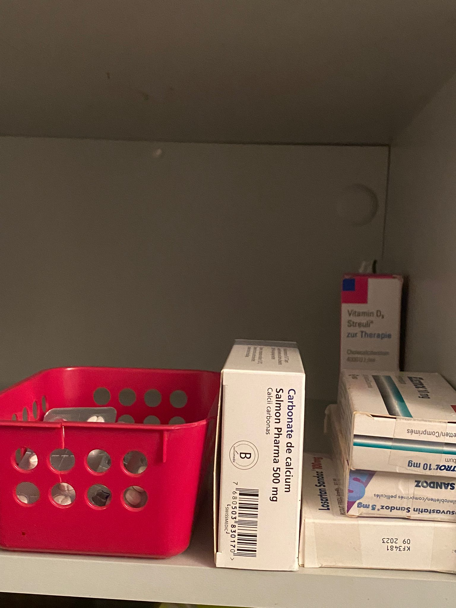
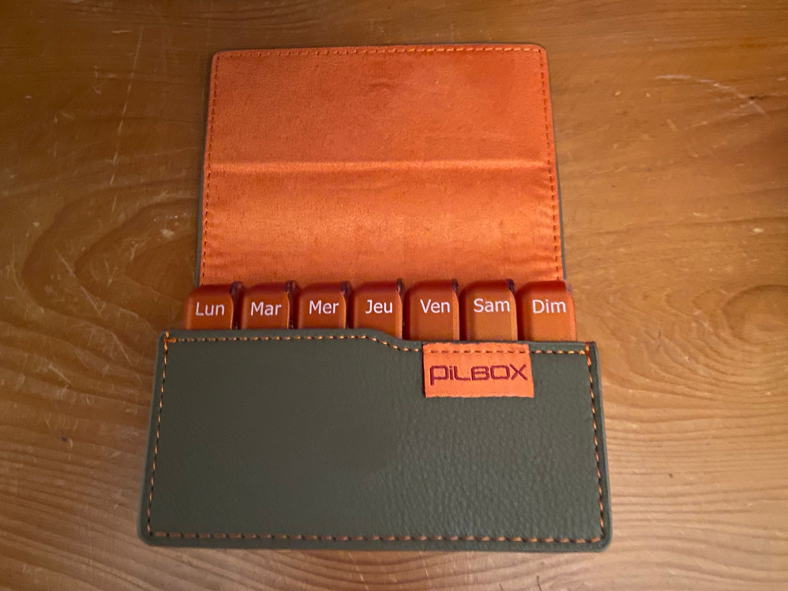
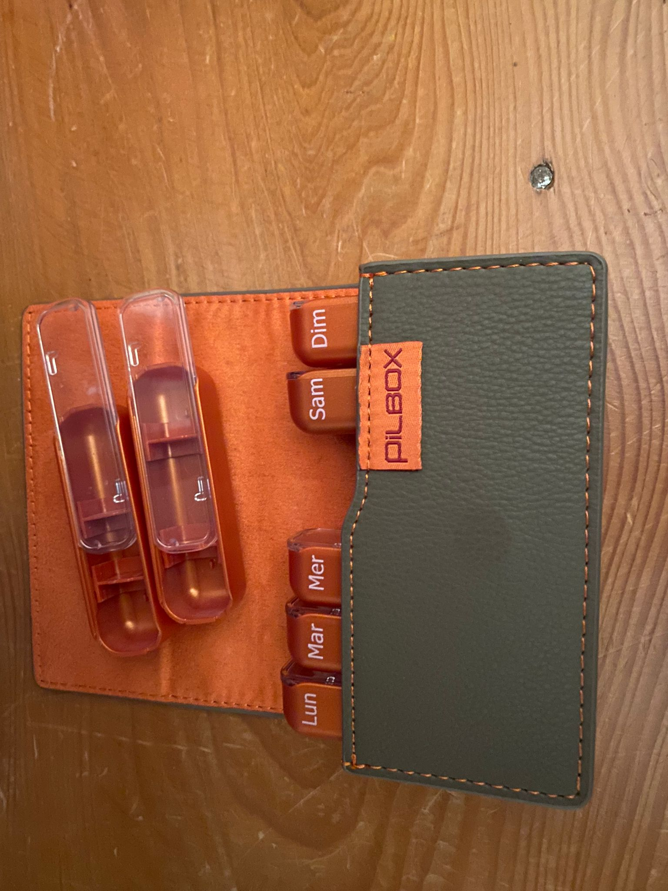

# This is my documentation from my interview with people and the way how they use their medication 
## questionnaire observation cours

age :23  
sex: woman  
sort of medication: contraceptive pill , anxiolytic  
frequency: every day before sleep (contraceptive pill)  
after meals (anxiolytic)  
organisation: iphone alarme  

age : 35  
sex : man  
sort of medication: blood pressure pills, polycystic kidney disease pills  
frequency: half of pill every morning (blood pressure), 1 pill in morning and 1 pill 8 hours after (polycystic kidney disease pills )  
organisation: in my mind every morning for bouth of them and alarme in phone  8 hours after for take second polycystic pill.

age : 17  
sex : woman  
sort of medication: insulin injection (diabetes)   
frequency: after eating sugur or meals or every 5 hours  
organisation: i have connected patch on my armes who give me in live my glycimie in my blood with application in my phone that how i know if i need to have ne injection. when i was kid, i needed to sting my finger every hours to check it by the nurs at school. it's very complicated for me even know to deal with my weakness. i try to hide my patch beacuase it's visible. 

age :22  
sex: woman  
sort of medication: contraceptive pill , antihistamine for allergie, pills for hestomec  
frequency: every day before sleep (contraceptive pill)  
for allergie pills everyday from febrery to july at night because it feel me sleep during the day.  
heartburn crisis i start to take pill every day during 6 days with every meals. (if i take this medication, i have to pay attention to not take any others medication for 2 hours because the dont make effect)  
organisation: contraceptive pill iphone alarme at 22:30 and i put it on the table next my bed to see before go to bed  
and others in my mind

age: 22 
sex : woman 
sort of medication : conrraceptive pill  
frequency: every day before sleep  
organisation: contaceptive pill alarme in my phone at 19:30 like that i have enough time to take it before sleep if i forget and i put it in my wallet

age : 27 
sex : woman 
sort of medication: acne treatment pills 
frequency: before every day during the meals for several mounths, after certain time one time every 3 days and now 1 time every week  
organisation : when it was every day i used to it, for every 3 days i write it in my placket the next day i have to take, and now i take every sunday  

age: 71  
sex: woman  
sort of medication :blood pressure pills, thins blood pills ,cholesterol pills , Hyperuricaemia pills (is an abnormally high level of uric acid in the blood because of  
renal failure), osteoporosis pills, vitamins B12 for renal failure, BI-DE (vitamine D-3) for Hyperuricaemia, estomac protection to support all the other traitements.  

frequency: blood pressure pills 1 every morning and 1 every evening   
thins blood pills 1 every morning   
cholesterol pills 1 every evening  
Hyperuricaemia pills 1 every morning  
osteoporosis pills 1 every morning and 1 every evening but not en the same time 2 hours later with others pills  
vitamins B12 : 1 time every week i take on sunday   
BI-DE or vitamine D-3: 70 drops per week i take also on sunday  
estomac protection : every day normaly at 14:30 but i take it at during the night when i wake up to go to WC  
organisation: i have 3 bascket in the kitchen, 1 with every pills for the morning , 1 with every pills for night and the last with the one for sunday.   
when i go to vaccation like chalet for short trip i put in pillbox  
when i go to vaccation like long trips i ask my pharmacy to prepare the portion in vaccume formes of my pills for journey time i pay 150 fr for this service.  

age :56  
sex: woman  
sort of medication : injection for Polyarthritis(is any type of arthritis that involves 5 or more joints simultaneously. It is usually associated with autoimmune conditions and may be experienced at any age and is not sex specific)   
frequency: 1 injection every week , another sort of injection every 3 week   
organisation: 1 do my injection every friday and the other i have calender in my fridge that i mark the next date because i have to conserve my injection in the fridge that's why i put my calnder there.  

 

