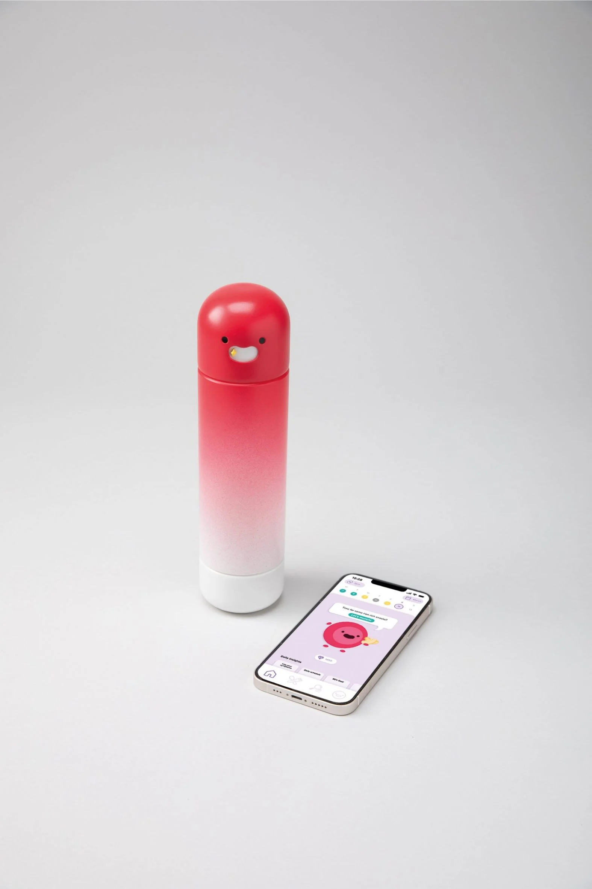

# here is some of my internet research 
https://intranet.designacademy.nl/archived-events/archive-events/milan-13/project?ProjectId=377  

we've rounded up five student projects presented on Dezeen School Shows that aim to upgrade and improve the design of healthcare apparatus.

These product and industrial design students have chosen to design medical products with the goal of improving patients' experience and subsequent wellbeing.

This roundup of projects includes a tampon applicator that can be used by people of all abilities, a wearable device that aims to treat sleep disorders, and an inflatable stretcher designed to help respond to accidents in the Canadian wilderness.

The selection of projects come from product design and industrial design courses at international institutions including Zurich University of the Arts, University of Wales Trinity St David, L'École de design Nantes Atlantique and Brunel University.  

